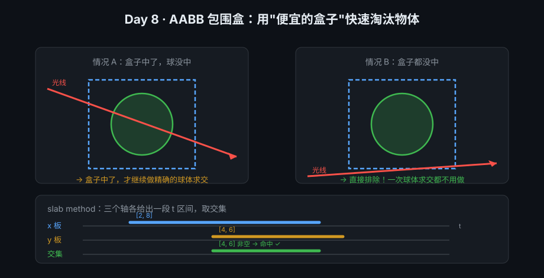
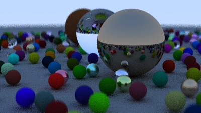
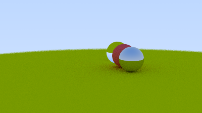

# cpp-renderer

从零实现的 C++17 光线追踪渲染器。

目标：完整跑通 **离线光追 → 实时渲染 → 高级特性 → 优化与工具化** 四个阶段，
把每一步的原理推导和踩坑记录写进 [`docs/devlog.md`](docs/devlog.md)。

---

## 效果展示

### Day 8 · AABB 包围盒（基础设施，画面不变）



> 加速结构的第一步：给每个物体算一个"外接轴对齐长方体"。
> 光线先试盒子（便宜、无开方），没中就直接排除整个物体，中了才做精确求交。
>
> **验收**：单元测试 23/23 通过；世界包围盒输出与手工验算一致；
> 渲染结果与 Day 7 **字节级完全一致**（172,127 B）—— 加速结构的第一原则是"结果不变，只是变快"。

### Day 7 · 程序化随机场景（480 个球）



> 400×225 · 32 spp · 纯渲染 13.0 秒
>
> 金属球反射出整个世界、玻璃球折射出内部透出的小球阵列、
> 476 个小球用 80% 哑光 / 15% 金属 / 5% 玻璃的概率随机生成。

### Day 6 · 可移动相机（景深）



> 相机参数：`lookfrom(13,2,3)` · `lookat(0,0,0)` · `vfov 20°` · `focus_dist 13.7` · `lens_radius 0.1`

<details>
<summary>🔍 Day 6 对照实验：故意对错焦（focus_dist = 5）</summary>


球在 13.9 米外、焦平面在 5 米处 → 球全部糊掉，但**构图与上图完全一致**。
这验证了「视口尺寸与距离同倍放大 → FOV 不变，只有焦平面移动」。

</details>

---

## 进度

| 天 | 内容 | 状态 |
|:--:|---|:--:|
| 1 | CMake 骨架、`vec3` / `ray` / `camera`、PPM 输出、渐变背景 | ✅ |
| 2 | 球体求交、法线着色、`Hittable` 抽象、多物体场景 | ✅ |
| 3 | 抗锯齿（三层循环 + 抖动采样）、Lambertian 漫反射（递归弹射） | ✅ |
| 4 | 材质系统：`Lambertian` / `Metal` / `Dielectric`、递归深度限制 | ✅ |
| 5 | 景深：薄透镜模型、`random_in_unit_disk`、弥散圆公式 | ✅ |
| 6 | 可移动相机：基向量 `u/v/w`、`vfov`、`focus_dist` | ✅ |
| 7 | 程序化随机场景（480 个球） + 性能测量方法论 | ✅ |
| 8 | **AABB 包围盒**（slab method + 单元测试体系） | ✅ |
| 9 | BVH 递归建树 | ⏳ |
| 10 | BVH 接入渲染器（`main.cpp` 零改动） | ⏳ |
| 11 | 性能对比：目标 **13 s → 0.3 s** | ⏳ |
| — | 后续：纹理映射、多线程、实时渲染、降噪 | 📋 |

---

## 性能数据（实测）

| 场景 | 物体数 | 平均弹射层数 | 求交次数 | 纯渲染耗时 |
|---|---|---|---|---|
| `simple_scene` | 4 | 1.63 | 1,874 万 | **0.28 s** |
| `random_scene` | 480 | 2.75 | **37.96 亿** | **13.03 s** |

求交吞吐量 ≈ **2.9 亿次 / 秒**（单线程）
> 🎯 **Day 9-11 目标**：用 BVH 把 `random_scene` 从 **13 s 降到 0.3 s**（约 50×）。
> BVH 把每层弹射需要测试的物体数从 `O(N)=480` 降到 `O(log N)≈9`。
> ⚠️ 讨论渲染性能请**直接计时 `raytracer.exe`**。
> `tools/run.ps1` 报的"总耗时"包含 CMake 编译（≈ 2.6 s），会严重干扰判断 —— 详见
> [devlog Day 7「原理 3」](docs/devlog.md)。

---

## 目录结构

```
cpp-renderer/
├── CMakeLists.txt
├── README.md
├── .gitignore
├── include/          # 头文件（全部基于接口/组合设计）
│   ├── rtweekend.h        工具箱：公共头、常量、随机数
│   ├── vec3.h             三维向量（身兼位置/方向/颜色）
│   ├── ray.h              光线 P(t) = O + tD
│   ├── aabb.h             轴对齐包围盒 + slab method 求交
│   ├── camera.h           可移动相机：像素坐标 -> 光线
│   ├── hittable.h         HitRecord + Hittable 抽象接口（hit / bounding_box）
│   ├── sphere.h           球体求交 + 包围盒
│   ├── hittable_list.h    物体列表（组合模式，将来换 BVH 只需改这里）
│   ├── material.h         Material 抽象接口
│   ├── lambertian.h       哑光
│   ├── metal.h            金属（镜面 + fuzz）
│   └── dielectric.h       玻璃 / 水 / 钻石（折射 + 全反射）
├── src/
│   └── main.cpp            ray_color + 场景构建 + 主循环
├── tests/
│   └── aabb_test.cpp       AABB 单元测试（独立可执行，1 秒反馈）
├── tools/
│   ├── run.ps1            一键：编译 -> 渲染 -> 转 PNG（分阶段报耗时）
│   ├── test.ps1           一键：编译 + 运行所有单元测试
│   ├── publish.ps1        一键：效果图归档 -> commit -> push
│   └── ppm2png.ps1        PPM(P3) -> PNG 转换
├── docs/
│   ├── devlog.md          技术日志（逐日原理推导 + 踩坑）
│   └── api.md             函数总览（速查手册）
├── gallery/          # 各阶段效果图（入库存档）
└── output/           # 运行时产物（不入库）
```

---

## 构建与运行

```bash
cmake -B build -G "MinGW Makefiles" -DCMAKE_BUILD_TYPE=Release
cmake --build build -j
./build/raytracer.exe          # Windows (MinGW)
```

一键脚本（推荐）：

```powershell
.\tools\test.ps1                             # 单元测试（1 秒反馈）
.\tools\run.ps1                              # 编译 + 渲染 + 转 PNG
.\tools\publish.ps1 -Message "Day 9: BVH" -Image day09-bvh.png   # 发布到 GitHub
```

输出：`output/image.ppm` → `output/image.png`

---

## 设计要点

- **组合模式**：`HittableList` 本身也是一个 `Hittable`，所以"一堆物体"和"一个物体"可以同样对待。
  将来把线性遍历换成 BVH 时，`main.cpp` 一行都不用改。
- **接口分离**：`Hittable` 回答"撞到了吗"，`Material` 回答"往哪弹、打几折"。
  加新材质（比如 `Isotropic`）时，`ray_color` 和求交代码完全不用动。
- **输出参数**：`scatter(r_in, rec, attenuation, scattered)` 用引用传出两个结果，
  配合 `bool` 返回"是否散射"。
- **递归深度限制**：玻璃的全反射会让递归无限深入（曾造成栈溢出 `0xC00000FD`），
  用 `max_depth` 作保险丝。

---

## 技术日志

完整推导（球体求交、Snell 定律、薄透镜成像、弥散圆、相机基向量…）见
[`docs/devlog.md`](docs/devlog.md)。函数速查见 [`docs/api.md`](docs/api.md)。
